<div align="center">

# ⚔️ BERSERK SURVIVORS

### A Berserk-Inspired Vampire Survivors Reimagining

_"Survive the Eclipse. Become the Struggler."_

[](LICENSE)
[]()
[]()
[]()

**Advanced Programming Course Project — Shahid Beheshti University**

<p align="center">
  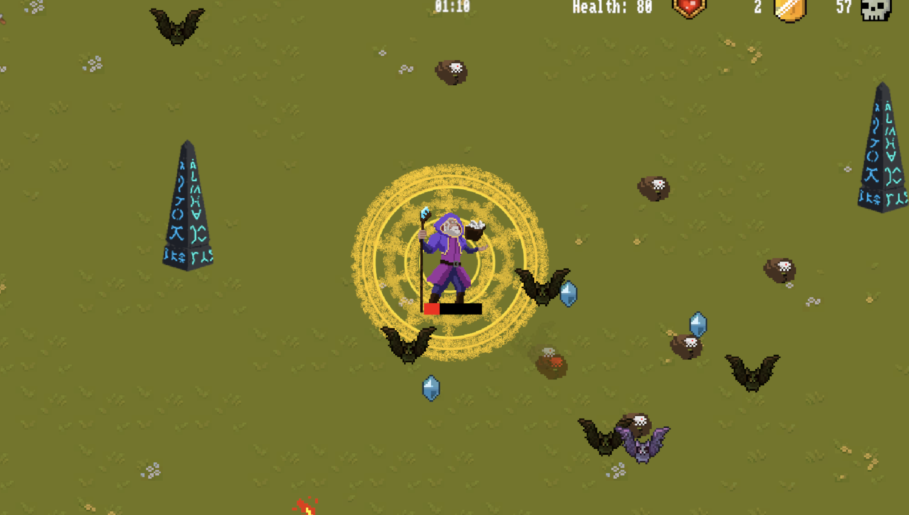
</p>

</div>

---
## 📥 Download

Grab the latest playable build from the [Releases page](https://github.com/<your-username>/<your-repo>/releases/latest).

## 📖 About the Project

**Berserk Survivors** is a fan-made reimagining of the roguelike bullet-heaven genre popularized by _Vampire Survivors_, rebuilt from the ground up with an original take on **Kentaro Miura's Berserk**. Fight endless waves of apostles and demons, wield weapons and abilities inspired by the world of Berserk, and survive the Eclipse — alone, or together with friends in real-time multiplayer.

This project was developed as the final project for the **Advanced Programming** course at **Shahid Beheshti University**. What started as a course assignment grew into a full game featuring a real account system, real-time multiplayer, a global leaderboard, and a persistent player progression system.

> **Disclaimer:** This is a non-commercial, fan-made project created for educational purposes. _Berserk_ and all related characters, names, and music are the property of Kentaro Miura / Hakusensha / Studio Gaga and their respective owners. This project is not affiliated with or endorsed by the original rights holders.

---

## ✨ Features

- 🌐 **Real Multiplayer** — Genuine real-time online multiplayer, survive the horde together with other players instead of the original's single-player-only format.
- 🔐 **Full Account System** — Sign up and log in with your email, complete with a working **Forgot Password** recovery flow.
- 👤 **Guest Mode** — Don't want an account? Jump straight in as a **Guest**. The UI always shows your current identity — your email when logged in, or "Guest" when you're not.
- 🏆 **Global Leaderboard** — Compete for the top spot and see how you stack up against other survivors.
- 📊 **Persistent Player Stats** — Every account tracks your **highest kill record** and total **coins** earned.
- 💬 **Send Feedback** — A built-in feedback tool lets players message the developers directly from within the game.
- ⚡ **Power-Up System** — Permanent meta-progression: upgrade **Magnet**, **Speed**, and **Health** from the main menu using earned coins.
- 🗡️ **In-Run Upgrade System** — Choose new weapons or upgrade existing ones as you level up mid-run.
- 🎭 **Multiple Playable Characters** — Each with unique weapons, playstyles, and Berserk-inspired designs.
- ❓ **"ASK ME" Assistant** — An animated in-menu help button that answers common questions (how to play, weapon info, how to upgrade, etc.) without leaving the main menu.
- 🎵 **Berserk-Themed Everything** — Character names, weapon names, and the soundtrack are all built around the Berserk universe.

---

## 🎮 Main Menu

The main menu gives players quick access to everything the game offers:

| Option             | Description                                                   |
| ------------------ | ------------------------------------------------------------- |
| **Multiplayer**    | Host or join a real-time multiplayer session                  |
| **Leaderboard**    | View the global rankings                                      |
| **Login / Signup** | Manage your account, or shows your email if already logged in |
| **Power Up**       | Spend coins on permanent upgrades (Magnet / Speed / Health)   |
| **Settings**       | Adjust game settings                                          |
| **Instructions**   | Learn how to play                                             |
| **Quit**           | Exit the game                                                 |

If you're not logged in, the menu displays **"Playing as Guest."** Once logged in, it displays your **account email**, along with your **highest kill record** and current **coin balance**.

<p align="center">
  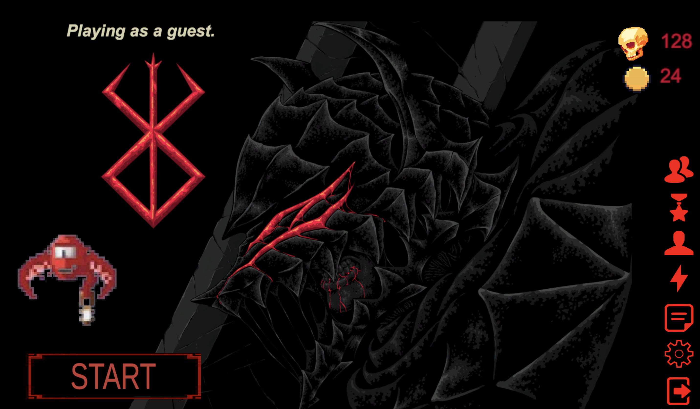
</p>

---

## ❓ ASK ME

An animated help button available right on the main menu. Click it and ask questions like _"How do I play?"_, _"What do the weapons do?"_, or _"How do upgrades work?"_ — and get instant answers without digging through a manual.

<p align="center">
  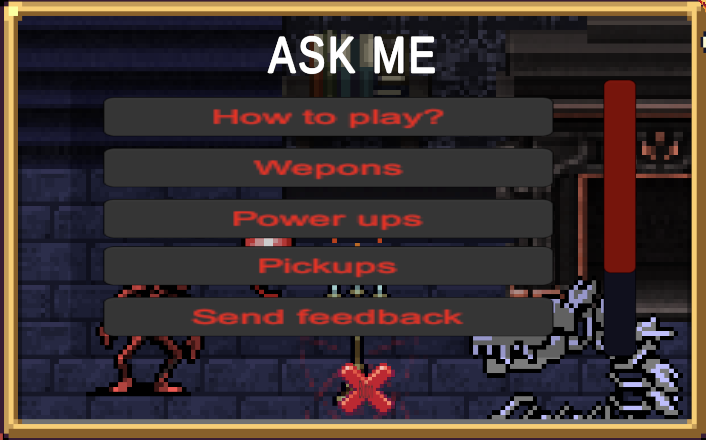
</p>

---

## 🗡️ Characters

Choose your Struggler before heading into battle. Each character comes with a unique starting weapon and playstyle.

<p align="center">
  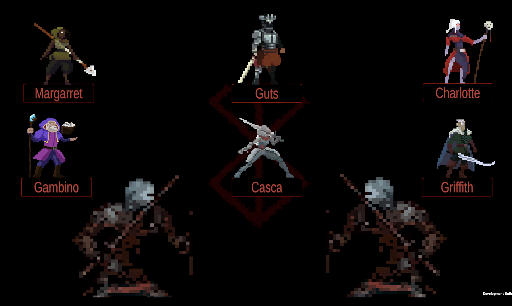
</p>

---

## 🩸 Gameplay

Survive endless waves of enemies, collect XP, and grow stronger as you go. Below are four characters, each with a different weapon in action.

<p align="center">
  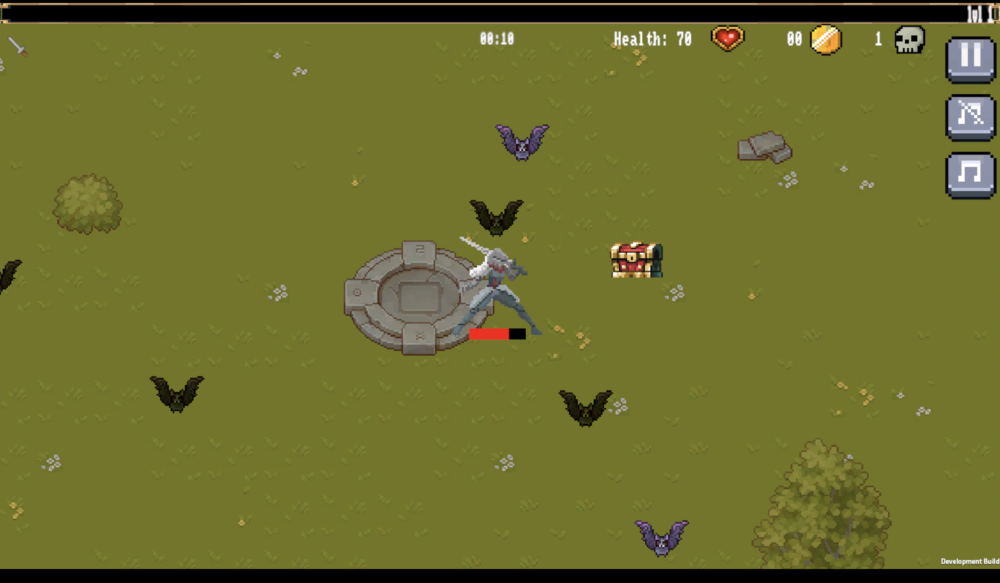
  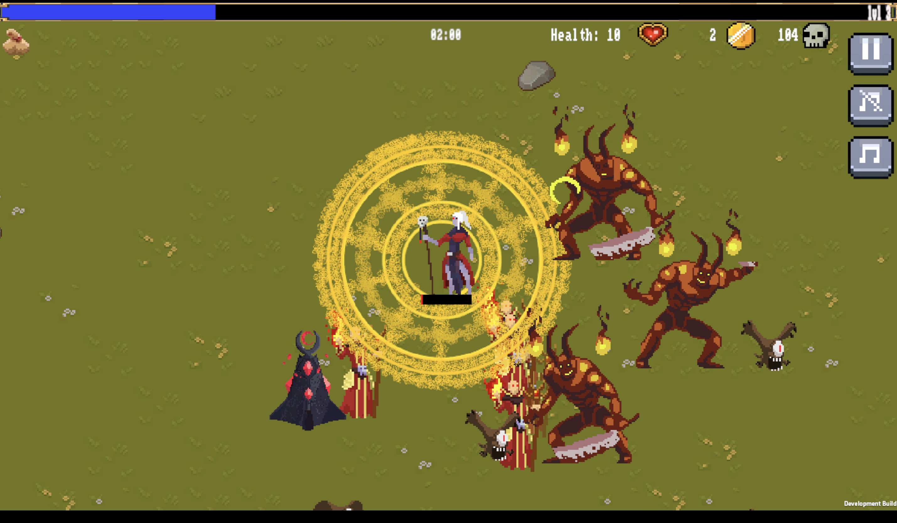
  <br/>
  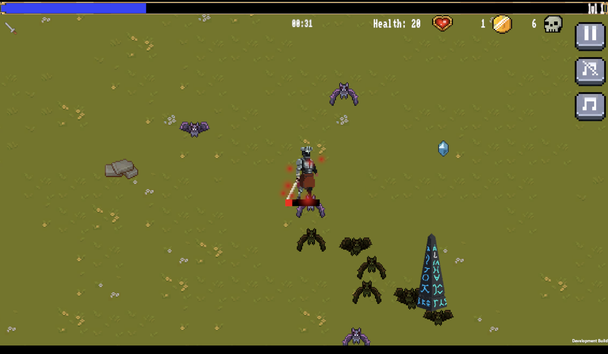
  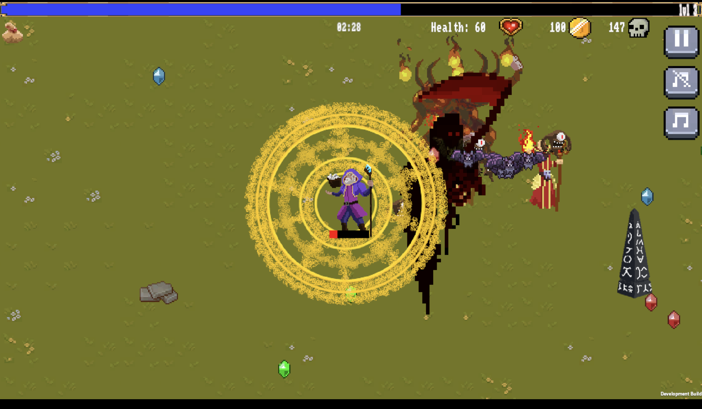
</p>

---

## 🌐 Multiplayer

Host or join a real-time multiplayer session and survive the Eclipse together with other players.

<p align="center">
  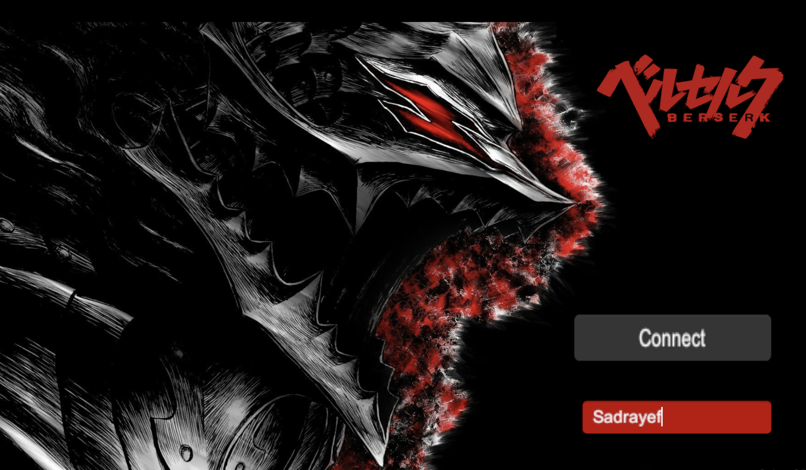
</p>

<p align="center">
  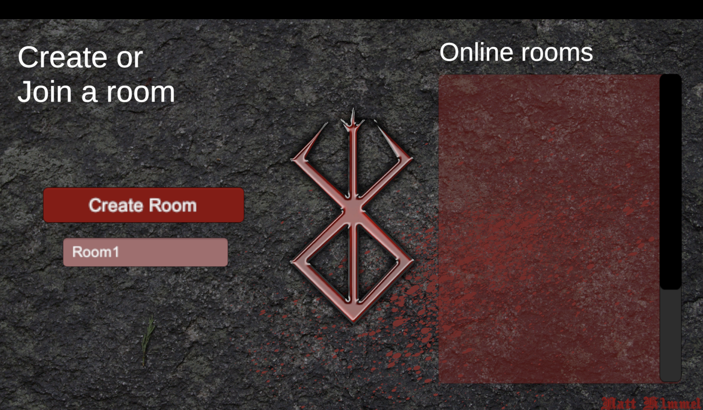
  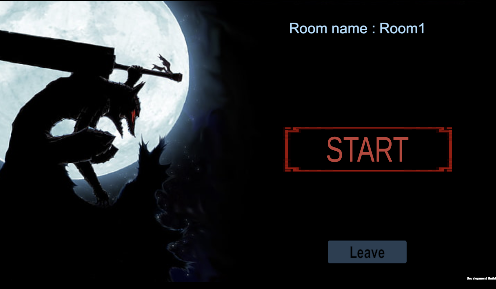

</p>

<!-- <p align="center">
  
</p>
<p align="center">
  
</p> -->

---

## ⚡ Upgrade Systems

Berserk Survivors has **two separate upgrade menus**:

### Power Up (Main Menu)

Spend coins earned from runs on permanent upgrades to **Magnet**, **Speed**, and **Health**.

<p align="center">
  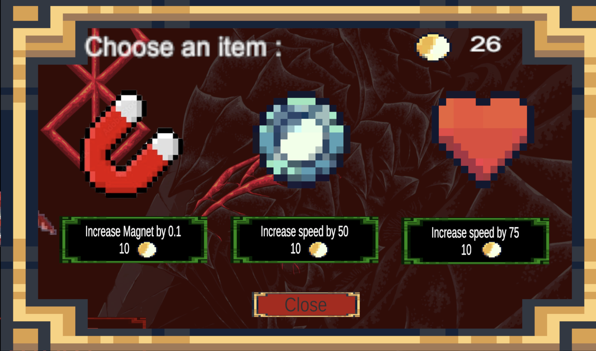
</p>

### In-Game Upgrade

Every time you level up mid-run, choose a **new weapon** or **upgrade an existing one**.

<p align="center">
  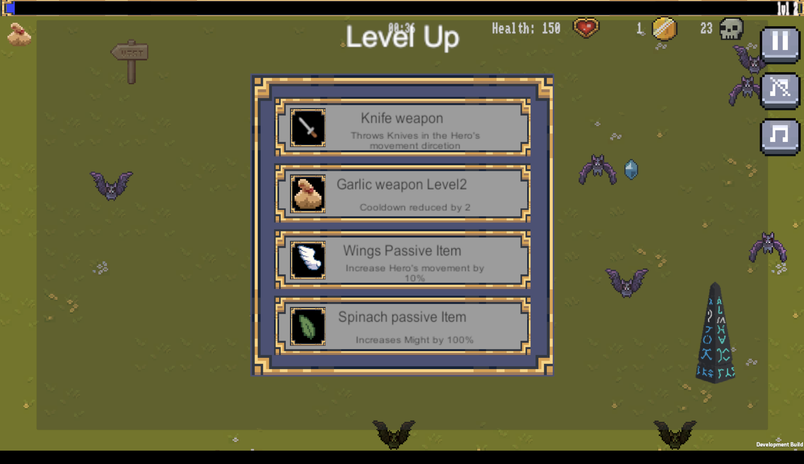
</p>

---

## ⏸️ Pause Menu

<p align="center">
  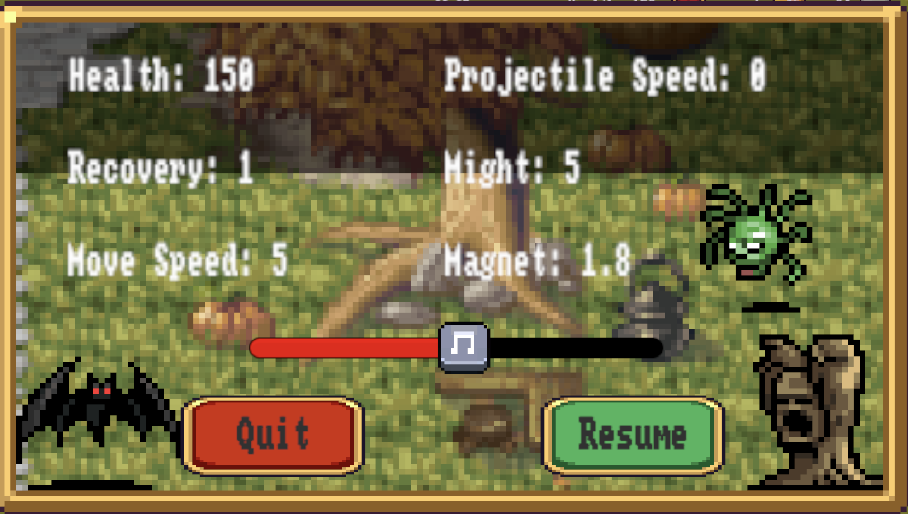
</p>

---

## 💀 Lose Menu

When a run ends, the Lose Menu sums up how you did:

- 🪙 **Collected Coins** — coins earned during the run
- 📈 **Level Reached**
- ⏱️ **Time Survived**
- ☠️ **Enemies Killed**

<p align="center">
  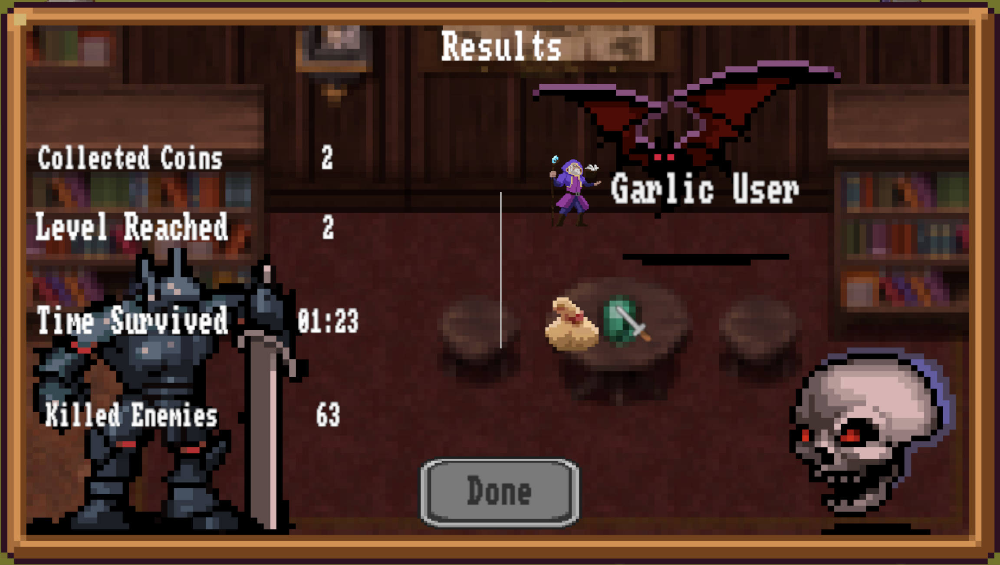
</p>

---

## 🛠️ Tech Stack

> Fill in with your actual stack — placeholders below.

- **Engine:** `[e.g. Unity 2022 LTS / Godot 4]`
- **Language:** `[e.g. C# / GDScript]`
- **Multiplayer Backend:** `[e.g. Photon / Mirror / custom sockets / Node.js + Socket.IO]`
- **Authentication & Database:** `[e.g. Firebase Auth + Firestore / custom REST API + PostgreSQL]`
- **Email (password reset / verification):** `[e.g. SMTP / SendGrid]`

---

## 🚀 Getting Started

### Prerequisites

- `[Engine name + version]`
- `[Any SDKs / dependencies]`
- A configured backend/environment for multiplayer and authentication (see [Configuration](#-configuration))

### Installation

```bash
# Clone the repository
git clone https://github.com/<your-username>/<your-repo>.git
cd <your-repo>

# Open the project in [Engine Name]
# Install dependencies (if applicable)
[install command here]
```

### Configuration

Multiplayer and account features require backend credentials. Create a `.env` (or engine-equivalent config) file with the following:

```
API_BASE_URL=
DATABASE_URL=
AUTH_SECRET=
SMTP_HOST=
SMTP_USER=
SMTP_PASS=
```

> ⚠️ Never commit your real credentials. Make sure `.env` (or equivalent) is listed in `.gitignore`.

---

## 🕹️ How to Play

1. From the **Main Menu**, choose to log in, sign up, or continue as a **Guest**.
2. Select **Multiplayer** to host/join a session, or start solo from the character select screen.
3. Choose your character — each comes with a unique starting weapon.
4. Survive waves of enemies, collect XP orbs, and level up to choose new weapons or upgrade existing ones.
5. Earn coins during runs and spend them in the **Power Up** menu between runs to permanently boost Magnet, Speed, and Health.
6. Check the **Leaderboard** to see how your kill count stacks up globally.
7. Stuck? Tap **ASK ME** on the main menu for quick answers on controls, weapons, and upgrades.

---

## 🎓 Course Context

This project was built as the final project for the **Advanced Programming** course at **Shahid Beheshti University**, demonstrating object-oriented design, networked/multiplayer architecture, and full account/authentication systems on top of a game built from scratch.

---

## 🗺️ Roadmap

- [ ] Additional Berserk-inspired characters and weapons
- [ ] More multiplayer game modes
- [ ] Boss battles
- [ ] Seasonal leaderboard resets
- [ ] Mobile support

---

## 🤝 Contributing

This is currently a personal/academic project, but suggestions and bug reports are welcome via Issues or the in-game **Send Feedback** tool.

1. Fork the repo
2. Create a feature branch (`git checkout -b feature/your-feature`)
3. Commit your changes
4. Open a Pull Request

---

## 💬 Feedback & Contact

Found a bug or have an idea? Use the in-game **Send Feedback** option, or open an issue on this repository.

---

## 📄 License

This project is licensed under the MIT License — see the [LICENSE](LICENSE) file for details.

_Berserk_ and related names, characters, and music referenced in this project belong to their respective rights holders and are used here for non-commercial, educational purposes only.

---

<div align="center">

_"Even if I am destined to die a meaningless death... I will not stop fighting."_

</div>
